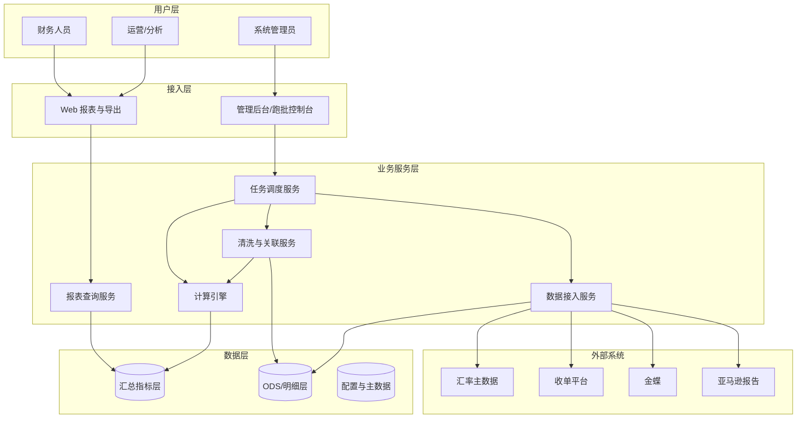
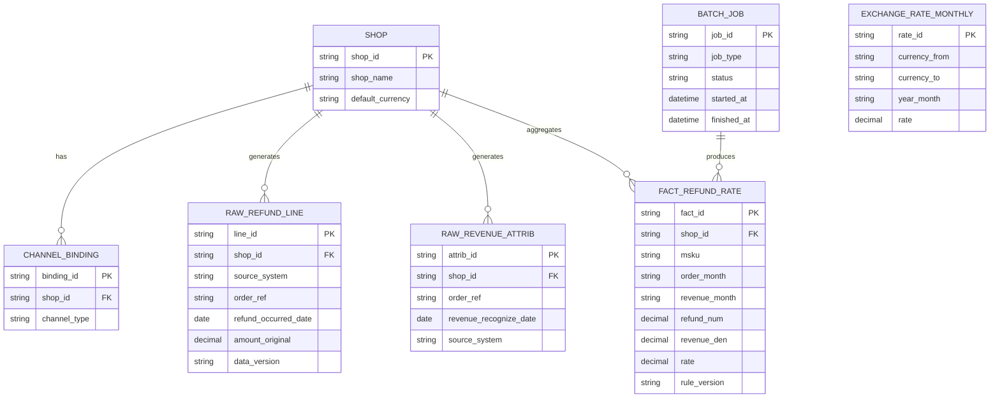
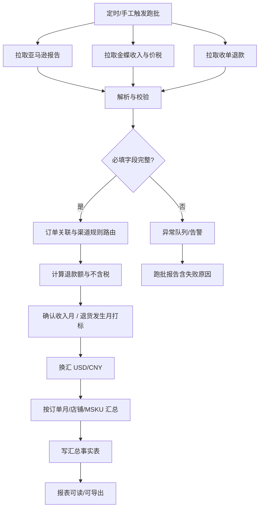
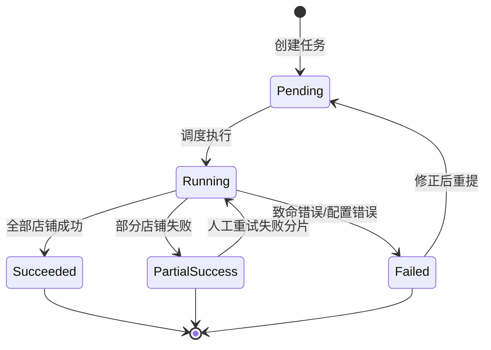

# 全渠道店铺退款率测算与退货计提支撑 PRD

| 项目 | 内容 |
| --- | --- |
| PRD 审核人 | [TODO: 填写] |
| 重要性 | 高 |
| 紧迫性 | 高（目标上线不晚于 2026-06-30） |
| 需求方 | 财务 |
| PRD 编写人 | [TODO: 填写] |
| PRD 提交日期 | 2026-04-08 |

## PRD 修改记录

| 变更时间 | 变更内容 | 变更提出部门与理由 | 修改人 | 审核人 | 版本号 |
| --- | --- | --- | --- | --- | --- |
| 2026-04-08 | 初版：基于 01_Parsing / 02_Identification 的 PRD 级规格 | — | [TODO] | [TODO] | v1.0 |

**关联文档**：`01_Parsing.md`（业务解析）、`02_Identification.md`（需求识别）。

> **产品定型**：根据现有描述，本项目为 **企业自研系统 × 业务型管理软件**（跨境电商 ERP / 业财一体化中的报表与测算模块），侧重数据口径、批处理可复现性与财务可追溯，而非对外商业化售卖。下文按该定型组织范围与非功能要求。

---

## 1、项目背景

### 1.1 现状

- 线上平台**退款率**曾依赖**建宏导数 + 财务手算**，部分大渠道仅覆盖**亚马逊美国**。
- 现需覆盖约 **40 个店铺**、按月测算，人工成本高且难以满足计提对**精度与可追溯**的要求。

### 1.2 问题

- 全店铺数据获取与口径不统一，难以支撑「**每店铺每月退货计提**」。
- 多渠道下**收入确认来源**不同（亚马逊报告 vs 金蝶），若混用易产生核算偏差。

### 1.3 立项动因

- 在 **2026-06-30 前**上线系统化能力，支持 **2025 年起**（发货下界 **≥ 2025-01**）按**订单创建月**滚动的历史补算与后续月度跑批，输出**报表 + 明细下载**（本期不对接金蝶凭证）。

---

## 2、需求基本情况

| 项 | 说明 |
| --- | --- |
| 需求名称 | 全渠道店铺退款率测算与计提支撑 |
| 需求类型 | 新增 / 能力建设 |
| 涉及渠道 | 亚马逊；Shopify、App 商城等（非亚马逊）；自营收单（已对接第三方） |
| 涉及系统 | 本模块（或 ERP 子模块）、亚马逊报告、金蝶、收单平台、汇率主数据 |
| 主要用户 | 财务（主）；运营/数据分析（辅，MSKU 下钻） |

---

## 3、商业分析（内部价值）

> 对内系统可弱化「市场规模」，强调成本与风险。

| 维度 | 说明 |
| --- | --- |
| 效率 | 替代 40 店人工导数手算，缩短月结前测算耗时 |
| 质量 | 口径固化、可重跑，减少计提争议与审计解释成本 |
| 风险 | 异常单可识别、明细可追溯，降低漏计/重计风险 |
| 范围 | 本期不自动推凭证，实施与合规边界清晰 |

---

## 4、项目收益目标

| 目标 | 衡量方式（建议） | 备注 |
| --- | --- | --- |
| 全覆盖 | 业务约定范围内的店铺 100% 纳入跑批范围 | 以店铺主数据勾选为准 |
| 可复现 | 同规则版本 + 同源数据重跑，汇总结果一致 | 需规则版本号 |
| 按期上线 | 2026-06-30 前生产可用 | 含历史补算能力 |
| 可追溯 | 每笔汇总可下钻至明细行及数据来源标签 | 报表 + 导出 |

---

## 5、项目方案概述

构建「**数据接入 → 清洗关联 → 口径计算（含税/不含税、换汇）→ 汇总指标（订单月、店铺、MSKU）→ 报表/导出**」闭环：

- **亚马逊**：Transaction（`type=refund`）+ Order 报告关联，确认收入月来自 Order；退款金额按既定字段组合，**不含平台税**。
- **非亚马逊**：确认收入日以**金蝶**为准；退款来自**收单对接**；不含税由金蝶**含税价、税额**推算（公式待财务锁定）。
- **换汇**：收入侧用**确认收入月**月度汇率；退款侧用**退货发生月**月度汇率。
- **补算**：按**订单创建月**滚动，且订单**发货日期 ≥ 2025-01-01**（边界规则待签字，见第 14 章）。

---

## 6、项目范围

### 6.1 本期包含（In Scope）

- 多源数据接入与解析（亚马逊报告、金蝶字段、收单退款）。
- 店铺/渠道主数据、月度汇率维护或同步。
- 计算引擎：退款组装、不含税推算、换汇、订单月退款率汇总、MSKU 粒度（含缺行级时的分摊规则配置位）。
- 定时月批、按创建月历史补算、重跑与幂等。
- Web 报表（趋势、筛选、下钻）与汇总/明细导出（CSV 或 Excel）。
- 跑批日志、异常与对账提示、规则版本留痕。

### 6.2 本期不包含（Out of Scope）

- 自动生成或推送金蝶凭证、总账接口。
- 替代财务最终计提审批流程（系统仅提供依据数据）。
- [TODO: 是否包含移动端、消息推送等非核心能力]

---

## 7、项目风险

| 风险 | 影响 | 缓解措施 |
| --- | --- | --- |
| 01/02 中分子分母、边界订单、非亚马逊「退货发生日」未最终签字 | 上线后需返工或报表更正 | 上线前召开财务口径评审，规则入配置表并版本化 |
| 亚马逊报告字段变更或延迟 | 解析失败或数据滞后 | 可配置字段映射；支持区间重跑；延迟告警 |
| 金蝶/收单接口不稳定 | 批处理失败或部分空数 | 重试、部分失败标识、禁止「静默完整报表」 |
| 全量补算数据量大 | 超时、资源占用 | 分批、断点续跑、限流；夜间窗口 |
| MSKU 仅订单级退款 | MSKU 报表偏差 | P1 明确分摊规则并与财务确认 |

---

## 8、术语与定义

| 术语 | 定义 |
| --- | --- |
| 订单月 | 用于展示与退款率统计的订单所属月份（与业务定义的「订单创建月」或等价字段一致，需在实现上与财务对齐） |
| 确认收入月 | 亚马逊：由 Order 报告推导；非亚马逊：金蝶确认收入日期所在月 |
| 退货发生月 | 退款实际发生日期所在月；**非亚马逊**取收单日或金蝶凭证日 **[TODO: 财务签字选定]** |
| 原币 | 店铺或订单记账原币种 |
| 计提版退款率 | 用于计提的分子/分母定义，以财务签字版为准 **[TODO: 公式固化]** |

---

## 9、参考文献与输入

- `docs/requirements/2026-04-08_财务退货率计提/01_Parsing.md`
- `docs/requirements/2026-04-08_财务退货率计提/02_Identification.md`
- [TODO: 亚马逊报告字段说明、金蝶接口说明、汇率表说明]

---

## 10、功能需求

### 10.1 产品框架概述

#### 10.1.1 应用架构（逻辑）

#### 10.1.2 核心实体关系（概念 ER）

> 实际物理表可拆分为亚马逊/金蝶/收单多张明细表，再统一进入 `RAW_*` 视图或宽表；上图为产品级概念模型。

#### 10.1.3 主业务流程

#### 10.1.4 跑批任务状态机

| 状态 | 说明 | 用户可见行为 |
| --- | --- | --- |
| Pending | 排队中 | 显示队列位置或计划时间 |
| Running | 执行中 | 进度百分比或店铺清单 |
| Succeeded | 全部成功 | 可查看最新报表与导出 |
| PartialSuccess | 部分失败 | 展示失败店铺与原因，汇总表标注「不完整」 |
| Failed | 整体失败 | 禁止展示「完整」汇总，仅错误与日志 |

#### 10.1.5 功能清单（与 02 对齐）

| 模块 | 功能 | 优先级 |
| --- | --- | --- |
| 数据接入 | 亚马逊 Transaction/Order 同步与解析 | P0 |
| 数据接入 | 金蝶确认收入日、含税价、税额 | P0 |
| 数据接入 | 收单退款（复用对接） | P0 |
| 主数据 | 店铺与渠道类型映射 | P0 |
| 主数据 | 月度汇率 | P0 |
| 计算 | 亚马逊退款公式与符号、不含税推算、换汇、订单月退款率 | P0 |
| 计算 | MSKU 分摊与缺省规则 | P1 |
| 任务 | 月批 + 创建月补算 + 重跑 + 幂等 | P0 |
| 任务 | 失败重试、对账提示 | P1 |
| 前端 | 趋势报表、筛选、MSKU 下钻 | P0 / P1 |
| 前端 | 分渠道税口径说明文案/标签 | P1 |
| 导出 | 汇总 + 明细 | P0 |
| 运维 | 边界规则配置、规则版本号 | P2 |

---

### 10.2 产品需求详解

#### 10.2.1 数据接入模块

| 需求 ID | 描述 | 验收要点 |
| --- | --- | --- |
| FR-D-01 | 支持按店铺配置亚马逊报告拉取范围与频率 | 可配置；失败可告警 |
| FR-D-02 | 解析 `type=refund` 行，保留原始金额符号 | 抽样与报告 CSV 一致 |
| FR-D-03 | 与 Order 报告关联得到确认收入月 | 无法关联进入异常清单 |
| FR-D-04 | 从金蝶同步确认收入日期、含税价、税额 **[TODO: 单据与字段]** | 字段映射文档化 |
| FR-D-05 | 从收单同步退款记录并与内部订单号关联 | 复用现有对接契约 |

#### 10.2.2 计算规则模块

| 需求 ID | 描述 | 验收要点 |
| --- | --- | --- |
| FR-C-01 | 亚马逊单行退款额 = 销售退货(销售额+运费收入+包装收入)+退货(折扣)；不含税项 | 与财务签字样例一致 |
| FR-C-02 | 非亚马逊不含税由金蝶含税价、税额推算 | 公式可配置 **[TODO: 公式]** |
| FR-C-03 | 收入金额换汇：确认收入月汇率；退款换汇：退货发生月汇率 | 每月每币种有且仅有一条生效汇率或明确插值规则 |
| FR-C-04 | 订单月退款率：分子分母定义与 BR-7 一致 **[TODO: 签字版]** | 配置变更留版本号 |
| FR-C-05 | MSKU：有行级用行级；无则按配置分摊 | 分摊规则可审计 |

#### 10.2.3 批处理与补算模块

| 需求 ID | 描述 | 验收要点 |
| --- | --- | --- |
| FR-B-01 | 支持按月定时跑批（全店或按店铺子集） | Cron 可配 |
| FR-B-02 | 支持按订单创建月批次历史补算，且过滤发货日 < 2025-01 的订单 **[TODO: 边界例外规则]** | 与财务确认一致 |
| FR-B-03 | 支持按时间区间重算（报告更正后） | 重跑后版本号递增 |
| FR-B-04 | 幂等：同一店铺+订单月+规则版本不重复累计 | 双跑结果一致 |

#### 10.2.4 报表与导出模块

| 需求 ID | 描述 | 验收要点 |
| --- | --- | --- |
| FR-R-01 | 汇总页：店铺 × 年/月趋势，展示原币、USD、CNY、退款率 | 筛选与钻取 |
| FR-R-02 | MSKU 页：在店铺+时间条件下展示 MSKU 级指标 | P1 |
| FR-R-03 | 导出：汇总表 + 明细表，编码与 Excel 兼容 | 明细含 02 所列审计字段 |
| FR-R-04 | 页面展示数据来源与税口径提示（亚马逊不含平台税 vs 金蝶推算） | P1 |

**明细导出建议字段（最小集）**

| 字段 | 说明 |
| --- | --- |
| 渠道类型 | 亚马逊 / Shopify / App… |
| 店铺 ID/名称 | |
| 订单参考号 | 平台或内部单号 |
| MSKU | |
| 订单月 | |
| 确认收入月 | |
| 退货发生月 | |
| 原币金额 | 收入侧/退款侧分行或列区分 |
| USD / CNY | 折算后 |
| 数据来源 | 报告 / 金蝶 / 收单 |
| 规则版本号 | |
| 异常标记 | 可空 |

#### 10.2.5 页面结构（PRD 级线框说明）

| 页面 | 核心元素 | 说明 |
| --- | --- | --- |
| 退款率概览 | 店铺多选、时间范围、渠道筛选；趋势图 + 汇总表 | 默认按月 |
| MSKU 分析 | 在概览条件下表格下钻 | P1 |
| 跑批中心 | 任务列表、状态、日志下载、重跑入口 | 权限受限 |
| 配置中心 | 店铺范围、分摊规则、公式版本 **[TODO: 权限模型]** | 仅管理员 |
| 异常与对账 | 未匹配退款、金蝶缺失、汇率缺失列表 | 可导出 |

---

### 10.3 异常情况处理方案

| 场景 | 系统行为 | 用户操作 |
| --- | --- | --- |
| 亚马逊 refund 无 Order 匹配 | 标记异常，不纳入汇总或进入「待核对」池 **[TODO: 默认策略]** | 导出核对后人工处理或补数重跑 |
| 金蝶缺确认收入或价税 | 该单行/单失败；跑批 PartialSuccess | 补全主数据后重跑 |
| 收单与金蝶不一致 | 对账清单 | 财务判定 |
| 汇率缺失 | 该币种该月失败，不静默延用 | 补汇率后重跑 |
| 报告延迟到达 | 支持次月补跑上月 | 任务记录说明 |
| 并发重复跑批 | 幂等覆盖或拒绝二次提交 **[TODO: 产品选择]** | 查看任务 ID |

---

## 11、数据埋点（建议）

| 事件 | 属性 | 用途 |
| --- | --- | --- |
| 跑批开始/结束 | job_id、店铺数、耗时、状态 | 稳定性与容量 |
| 报表查询 | 筛选条件、结果行数 | 使用频率 |
| 导出点击 | 汇总/明细、格式 | 审计与体验 |
| 异常列表查看 | 异常类型分布 | 数据质量改进 |

[TODO: 与公司统一埋点规范对齐]

---

## 12、角色和权限

| 角色 | 权限概要 |
| --- | --- |
| 财务用户 | 查看报表、导出、查看跑批结果与异常（只读） |
| 运营/分析 | 查看报表与导出（可按数据域限制店铺） **[TODO]** |
| 系统管理员 | 跑批触发、配置、重跑、汇率与映射维护 |
| 审计 | 只读日志与历史导出记录 **[TODO]** |

[TODO: 与现有 ERP 账号体系对接方式]

---

## 13、运营与上线计划（建议）

| 阶段 | 内容 | 时间建议 |
| --- | --- | --- |
| 口径冻结 | 财务签字：分子分母、边界订单、退货发生日、金蝶字段 | 开发前 |
| 联调 | 2～3 个店铺沙箱验证 | 开发中后期 |
| 并行试跑 | 与手算结果对比，差异可解释 | 上线前 |
| 历史补算 | 按创建月分批执行，监控资源 | 上线初期 |
| 月结节奏 | 与财务月结日历对齐的定时任务 | 上线后 |

---

## 14、待决事项（汇总）

| ID | 事项 | 责任人建议 |
| --- | --- | --- |
| TBD-01 | 订单月退款率分子/分母最终公式（是否含运费、包装、折扣；与亚马逊分子对齐） | 财务 |
| TBD-02 | 创建月 vs 发货 ≥2025-01 边界订单是否纳入及归属批次 | 财务 |
| TBD-03 | 非亚马逊「退货发生月」取收单日还是金蝶凭证日 | 财务 |
| TBD-04 | 金蝶单据与字段清单（确认收入、含税价、税额） | 财务 + 实施 |
| TBD-05 | 不含税推算公式（价内/价外） | 财务 |
| TBD-06 | MSKU 无行级退款时的分摊规则 | 财务 |
| TBD-07 | 汇率表来源与缺失时的备用策略 | 财务 |
| TBD-08 | 幂等重跑策略（覆盖 vs 拒绝） | 产品 + 研发 |

---

## 附：待完善清单

- [ ] 填写 PRD 审核人、编写人
- [ ] 附亚马逊样例报告与字段映射表
- [ ] 附金蝶接口字段说明
- [ ] 附 2～3 个店铺验收样例（含预期退款率区间或金额）
- [ ] 与法务/安全确认导出字段脱敏要求
